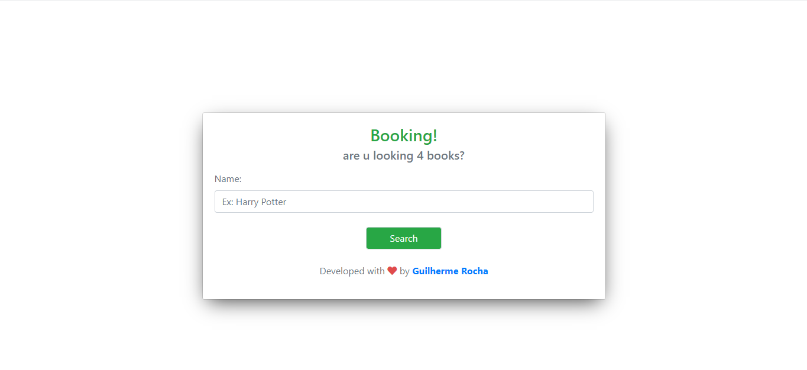

<h1 align="center">
 

</h1>

O projeto trata-se de um <b>"Bookfinder"</b>, onde o usuário busca o título de um livro e o website retorna para o mesmo, uma lista com os possíveis resultados.

## 🚀 Tecnologias Utilizadas
<ul>
<li>HTML</li>
<li>CSS</li>
<li>Bootstrap</li>
<li>JavaScript</li>
<li>jQuery</li>
</ul>
 

Enjoy it! 👽
